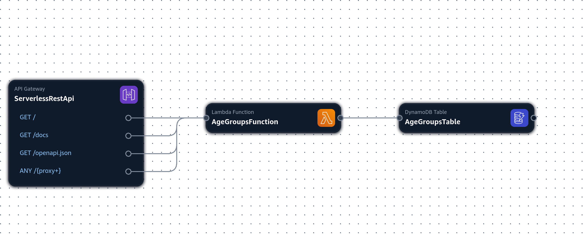
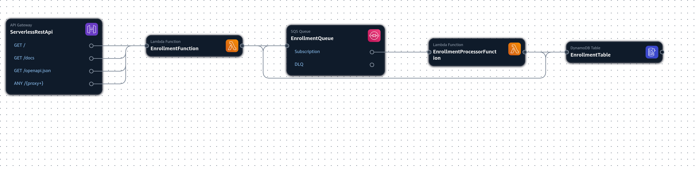

# SUTHUB Technical Assessment - Serverless APIs with AWS SAM

This repository contains two serverless RESTful APIs built using AWS services. Each API is deployed as a separate stack, exemplifying a real-world microservices architecture.

## Table of Contents

- [SUTHUB Technical Assessment - Serverless APIs with AWS SAM](#suthub-technical-assessment---serverless-apis-with-aws-sam)
  - [Table of Contents](#table-of-contents)
  - [Overview](#overview)
  - [Project Description](#project-description)
  - [Objectives](#objectives)
  - [Stacks](#stacks)
  - [API Endpoints](#api-endpoints)
    - [Age Groups API](#age-groups-api)
    - [Enrollment API](#enrollment-api)
  - [Technologies Used](#technologies-used)
  - [Build and Deployment Instructions](#build-and-deployment-instructions)
    - [Prerequisites](#prerequisites)
    - [Building and Deploying the Age Groups API](#building-and-deploying-the-age-groups-api)
    - [Running Integration Tests for Age Groups API](#running-integration-tests-for-age-groups-api)
    - [Building and Deploying the Enrollment API](#building-and-deploying-the-enrollment-api)
    - [Running Integration Tests for Enrollment API](#running-integration-tests-for-enrollment-api)

## Overview

This project consists of two serverless RESTful APIs built using FastAPI and AWS services. These APIs manage age groups and enrollments, leveraging a fully serverless architecture. The APIs are deployed as separate stacks, showcasing a microservices architecture. The project also includes integration tests for both APIs.

## Project Description

The project employs the following AWS services:

- **AWS Lambda:** Executes code in response to HTTP requests and other triggers.
- **Amazon SQS:** Provides a message queue for decoupling and scaling microservices.
- **Amazon API Gateway:** Serves as the single entry point for API requests.
- **Amazon DynamoDB:** A NoSQL database used for fast and scalable data storage.

AWS SAM (Serverless Application Model) is used for infrastructure as code, enabling streamlined build and deployment processes.

## Objectives

The primary objectives of this project are to:

- Develop two RESTful APIs using FastAPI and AWS services:
  - **Age Groups API:** Manage the creation, retrieval, and deletion of age groups.
  - **Enrollment API:** Handle enrollment requests and check their status.

## Stacks

**Age Groups API:**


**Enrollment API:**


## API Endpoints

**Credentials**

Except the root endpoint, all other endpoints are configured with basic authentication. Each API has its own set of credentials defined as environment variables described in the `config.py` file of each project.

As default, the credentials are:

**Age Groups API:**
- Username: `admin`
- Password: `try2crack`

**Enrollment API:**
- Username: `user`
- Password: `strongpassword`

### Age Groups API

- `POST /api/v1/age_groups/`: Create a new age group.
- `DELETE /api/v1/age_groups/{name}`: Delete an age group by name.
- `GET /api/v1/age_groups/`: List all age groups.

### Enrollment API

- `POST /api/v1/enrollments/`: Request enrollment.
- `GET /api/v1/enrollments/{CPF}`: Check enrollment status by CPF (unique identifier).

## Technologies Used

- **FastAPI:** A modern, fast (high-performance), web framework for building APIs with Python, based on standard Python type hints.
- **Pydantic:** Used for data validation and settings management using Python type annotations.
- **Pydantic-settings:** Manages application configuration via environment variables, enhancing security and manageability.
- **Boto3:** The AWS SDK for Python, which allows Python code to interact with AWS services like S3, EC2, and DynamoDB.

## Build and Deployment Instructions

The project utilizes a Makefile to streamline the build and deployment processes.

### Prerequisites

Before you begin, ensure you have the following:

- An AWS account with the necessary permissions.
- AWS SAM CLI installed. Follow the [AWS SAM CLI Installation Guide](https://docs.aws.amazon.com/serverless-application-model/latest/developerguide/install-sam-cli.html) to set it up.

### Building and Deploying the Age Groups API

To build and deploy the Age Groups API, run the following command:

```bash
make build-age-groups-api-stack && make deploy-age-groups-api-stack
```

### Running Integration Tests for Age Groups API

To run integration tests for the Age Groups API, execute:

```bash
pytest age-groups-api/
```

### Building and Deploying the Enrollment API

To build and deploy the Enrollment API, run:

```bash
make build-enrollment-api-stack && make deploy-enrollment-api-stack
```

### Running Integration Tests for Enrollment API

To run integration tests for the Enrollment API, execute:

```bash
pytest enrollment-api/
```
